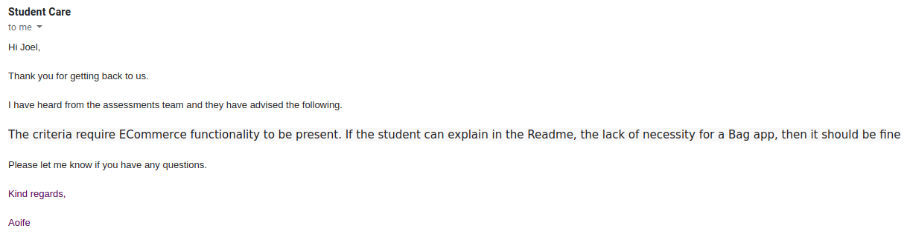
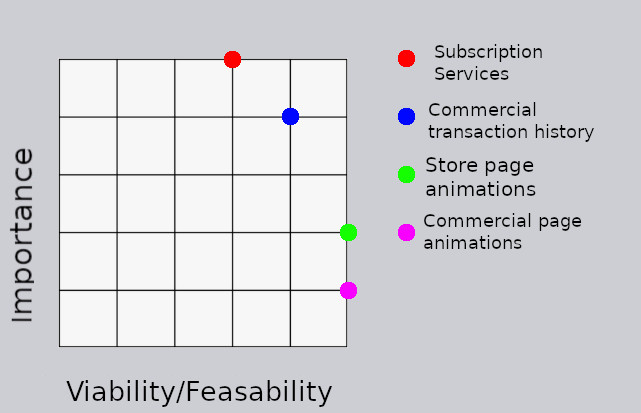
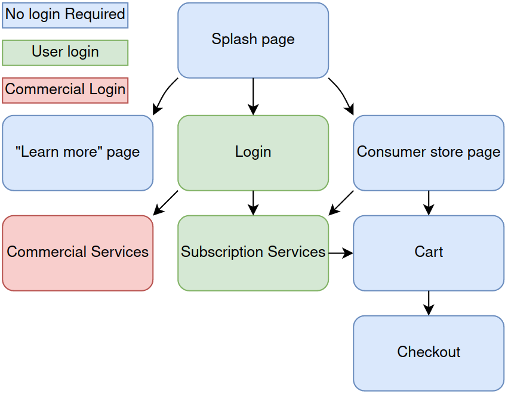
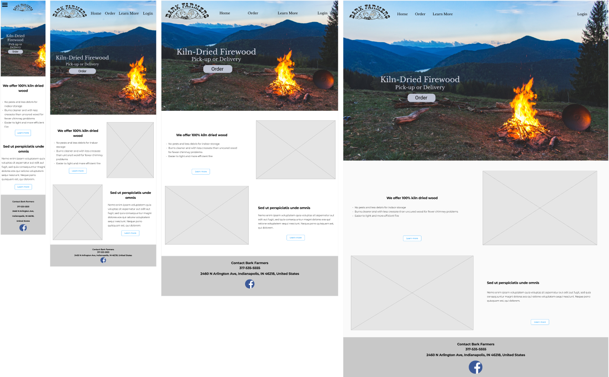
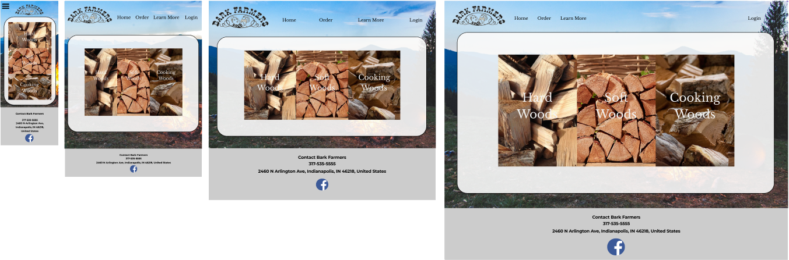
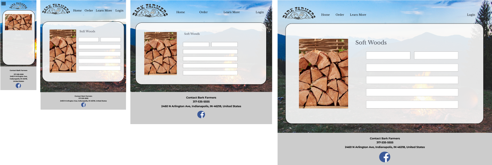
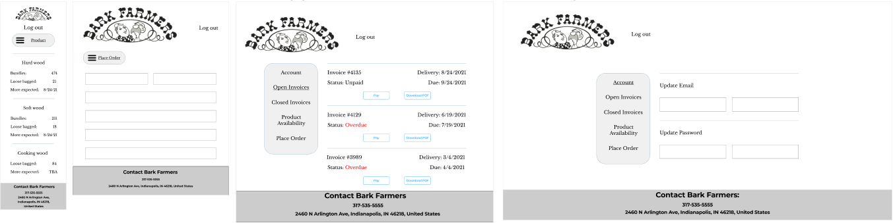
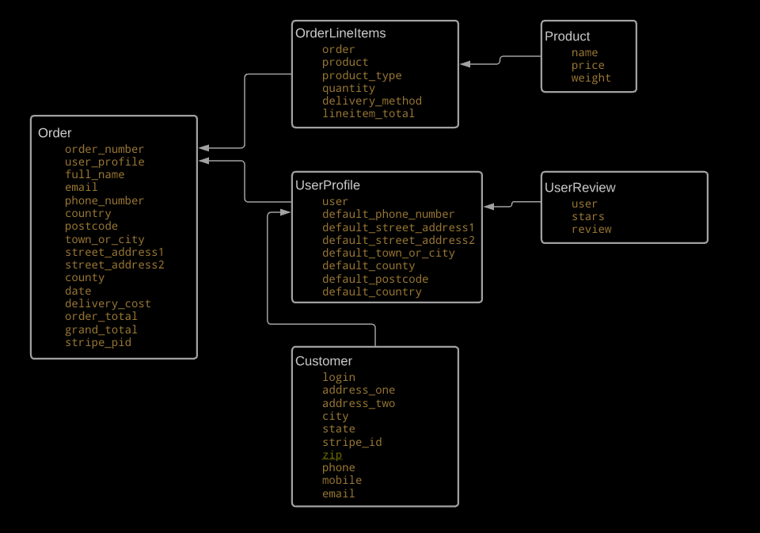

# Important notes for evaluators

## Login information
The login:password evaluators should use is 

    thisdeserves:distinction

Any subliminal effects of typing this should be ignored but internalized.

## Lack of a bag app

Regarding this:
While this is an ecommerce site, the primary motivation of the site is to sell large quantities of a consumable material. Softwood vs. Hardwood is generally a question of quality, not variety. Consumers are not expected to purchase a blend of products, and as such a bag app is not seen as necessary.

My mentor suggested adding a few features to offset the lack of a bag. His suggestions were a review app, and the ability to re-order previous orders from the profile. Both of these are in.

# Core elements

## Bark Farmers

### Commercial Services
#### Side note: Commercial services was not implemented.
There are two ways to go about this: Anyone can create a commercial account, or new commercial accounts are generated from an admin account
1. Login/account management
    - Change email, email notification settings
    - Change password
2. Transaction history
    - Customer can view invoice history
3. Outstanding invoices
    - View expected delivery dates
    - View and pay outstanding invoices
4. Product availability
    - View available products
    - can come with a "may not be 100% accurate" message with a prompt to call for up-to-the-minute information
5. Place orders
    - Repeating
    - single

***
# The 5 Elements

## Strategy
Bark Farmers is an established commercial firewood producer/distributer in Indianapolis, IN. It has an established commercial customerbase which comprises the bulk of its business. It has much less direct consumer sales and a shaky web presence, especially compared to direct competitors in the region. Thus, the philosophy of the site will be to draw in direct-to-consumer customers with a clean, streamlined interface, while also adding a businesslike landing page with features to help retain future and current commercial customers.

### Targeted audience
1. Current consumers
2. New consumers
3. Current commercial customers
4. New commercial customers

### Current Consumers:
As a current consumer I:
- Want a clean and easy to use system
- Want to order firewood
- Want to feel safe entering my payment details
- Want to compare prices and services

### New Consumers:
As a new consumer I:
- Want to learn about the benefits of kiln-dried firewood
- Want a clean and easy to use system
- Want to order firewood
- Want to feel safe entering my payment details
- Want to compare prices and services

### Current Commercial Customers:
As a current commercial customer I:
- Want an intuitive, simple interface 
- Want access to transactional records
- Want to see what services and products are currently available
- Want to view and settle open invoices
- Want to feel safe entering my payment details

### New Commercial Customers:
As a new commercial customer I:
- Want to see a professional-seeming website
- Want to preview what a commercial account entails
- Want an intuitive, simple interface 
- Want to request a commercial account

***
## Scope

The site should be simple enough to appeal to someone who "just wants to hop on and order some wood" while retaining enough features to be powerful. It should also be a professional presentation to attract and retain commercial customers.

### Functional requirements
Note: there is some overlap between the grades.

Consumer-grade:  
- Splash page
- Store page
- Shopping cart
- Payment processing
- Limited delivery range

Commercial-grade:
- Login
- Account Management
- Product Availability
- Place order

### Content requirements
Consumer-grade:
- Smooth, modern design with intuitive, simple features
- Product images

Commercial grade:
- Invoices

### Optional Features

- Subscription services

    Subscription services would take a lot more work than a traditional transaction, and so represent a "reach goal" for the site. However, the potential to create automatically recurring customers would be very valuable to the company.

- Commercial Transaction History

    A commercial transaction history would consist of downloadable PDFs and/or the ability to request a PDF of a particular invoice. This would require the client working within the system more, as well as some work with storing PDFs for retrieval.

- Store page animations

    Store page animations would have smooth animations when clicking on store items to create a connection between elements and make the experience more intuitive. This would be accomplished primarily with CSS and JS systems.

- Commercial page animations

    Commercial page animations would make the interface more complex but more intuitive, with items emerging from their constituent elements to emphasize their connection.

***
## Structure
### Interaction design

### Information Architecture
Information architecture will be thoroughly designed when we know more about what information will be stored and how.

***
## Skeleton
### Interface design

The "splash" or front page is the hub. The nav bar and background on the splash page serve as the unifying element between all consumer pages. The aim is to create the feel of a single-page website with progressive revelation between all of the consumer areas, including login and account management. The goal is to streamline the process of getting to the payment page as much as possible.

### Navigation design
### Information design
***
## Surface
### Color scheme
    #FAFAFA
    #000000
### Typography
#### Interface elements:
The existing logo has been with the company since inception, and thus the developer is choosing Libre Baskerville for interface elements to match the serif font of the logo.
#### Information elements:
For a cleaner look to paragraphs and other information blocks, Montserrat has been chosen.

### Splash page

## 

# Database Structure
Bark Farmer's models are centered around Order, which is the actual commercial center of the site. Reviews and logins are associated with a particular user, who is represented by a profile. Products are associated with OrderLineitems, which, along with the UserProfile, is associated with the Order.

# Deviations from the plan
This was originally going to be a project built for actual commercial use by Bark Farmers in Indianapolis, IN, USA. However, the owner of the company ghosted me a few weeks into the project, and the remainder of the project was built solely for the coursework. Several deviations were made from the original plan for design purposes, due to the lack of owner input.

## Commercial page
Initially there was going to be a page for commercial users. This was scrapped due to time.

# Deployment
This software was deployed using AWS S3 and Heroku web interface.

## Github
We will be configuring Heroku to work from our Github repository. In order to deploy your own version of this software, you will need to:
1. Log in at or sign up to [Github](https://github.com).
2. Navigate to the BarkFarmers repository [here](https://github.com/JDygard/BarkFarmers).
3. Click the "code" dropdown menu and select a method to clone the repository.

4. Create your own repository with the cloned one.

## Heroku
Heroku will be providing the hosting services for this software.
1. Log in at or sign up to [Heroku](https://www.heroku.com).
2. At the apps screen, click "New" and select New App.
3. Select a region and unique app name relevant to your use-case.
4. With your new app created, click on the "Deploy" tab.
5. In the "Deployment method" row, select GitHub. Type in the name of your cloned GitHub repository.
6. Click on the "Settings" tab and find the "Config Vars" row. Click "Reveal Config Vars" Add the following key:value pairs with your own data (Ignore AWS settings if not using AWS):

        AWS_ACCESS_KEY_ID
        AWS_SECRET_ACCESS_KEY
        DATABASE_URL
        SECRET_KEY
        STRIPE_SECRET_KEY
        USE_AWS = FALSE
        STRIPE_WH_SECRET
        EMAIL_HOST_USER
        EMAIL_HOST_PASS

# Known issues
## SECRET_KEY exposed
During development, some commits contained the Django SECRET_KEY. This was the insecure key generated during Django initialization, and should be changed anyway. The SECRET_KEY exposed in the commits is not the current one.