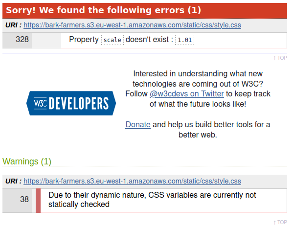

# Testing for Bark Farmers

## Contents

* [Code Validation](<#code-validation>)
* [Automated Testing](<#automated-testing-with-jest-and-unittest>)
* [Responsiveness Test](<#responsiveness-test>)
* [Known Bugs](<#known-bugs>)
* [Additional Testing](<#additional-testing>)

# Code validation
## CSS Validation

With all due respect to the w3c validator, the scale property does exist. It is a method from the transform property, but can be accessed independantly through the scale property name.

And as much as CSS variables are not statically checked, it works in this use-case.

# Automated Testing

# Responsiveness Test

# Known Bugs

# Additional Testing
