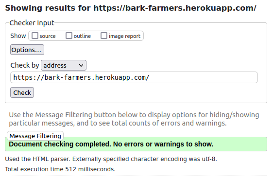
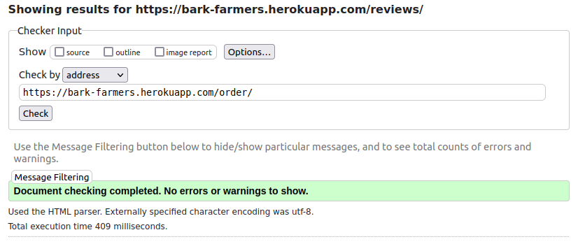
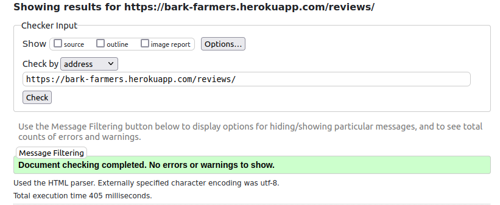
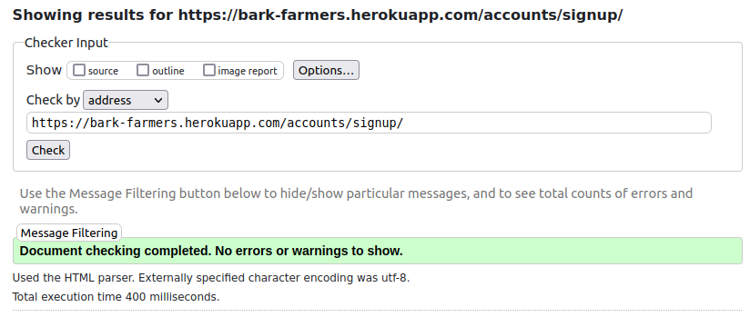
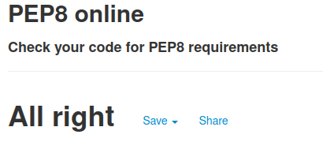

# Testing for Bark Farmers

## Contents

* [Code Validation](<#code-validation>)
* [Automated Testing](<#automated-testing-with-jest-and-unittest>)
* [Responsiveness Test](<#responsiveness-test>)
* [Known Bugs](<#known-bugs>)
* [Additional Testing](<#additional-testing>)

# Code validation
## CSS Validation

With all due respect to the w3c validator, the scale property does exist. It is a method from the transform property, but can be accessed independantly through the scale property name.

And as much as CSS variables are not statically checked, it functions adequately in this use-case.

## HTML Validation
### Index.html

### Order.html

### Reviews.html

### Register.html

Register was chosen to represent testing for all of the account-related forms, as it is the most complex of them.

## PEP8 Compliance testing
PEP8 compliance testing was done using [PEP8 online](http://pep8online.com/)
### Checkout views

# Automated Testing

# Responsiveness Test

# Known Bugs

# Additional Testing
