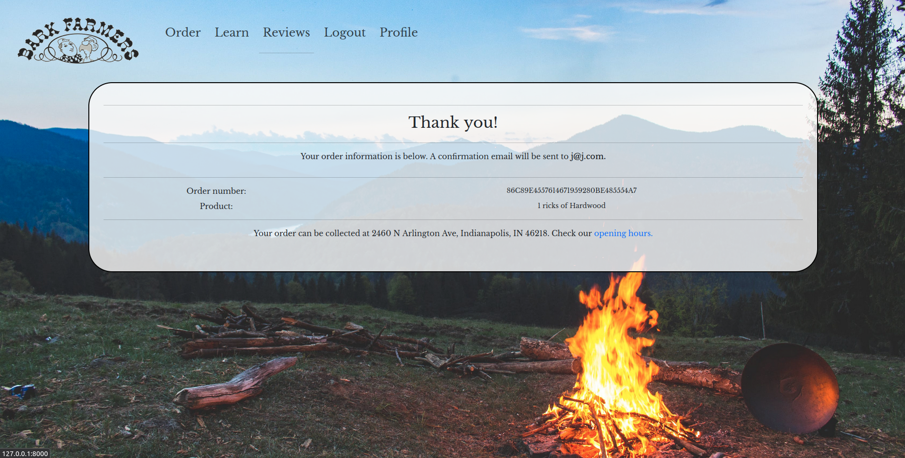
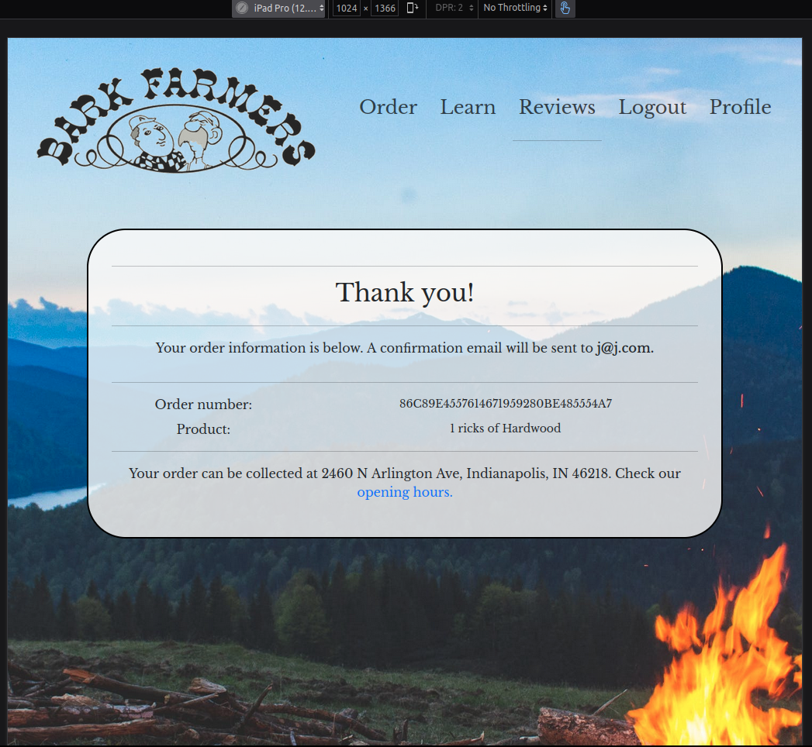
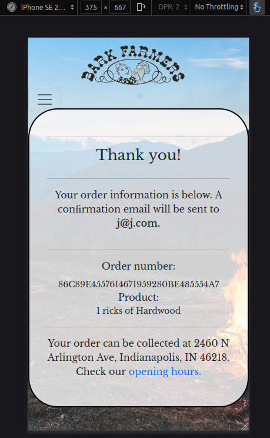

# Testing for Bark Farmers

## Contents

* [Code Validation](<#code-validation>)
* [Responsiveness Test](<#responsiveness-test>)
* [Additional Testing](<#additional-testing>)

# Code validation
## CSS Validation

With all due respect to the w3c validator, the scale property does exist. It is a method from the transform property, but can be accessed independantly through the scale property name.

And as much as CSS variables are not statically checked, it functions adequately in this use-case.

## HTML Validation
### Index.html

### Order.html

### Reviews.html

### Register.html

Register was chosen to represent testing for all of the account-related forms, as it is the most complex of them.

## PEP8 Compliance testing
PEP8 compliance testing was done using [PEP8 online](http://pep8online.com/)
### Checkout views

This is the result on the checkout view, and all other view files.

# Responsiveness Test
The responsiveness test is split into parts, each representing one of the page templates.

## Index page

(Note: This screenshot was taken before the media query fixing the small white arrow in the "Learn more" text was implemented. The final version is corrected)

## Profile-box

# Additional Testing
All responsiveness testing performed in Ubuntu Firefox v97.0
XL will be represented by the native display resolution of tester's display, 2560 x 1440 pixels. (Although, this is technically xxl according to Bootstrap)
L will be represented by the native display resolution of tester's 2nd display, 1920 x 1080 pixels.
M will be represented by iPad Safari 14.1, 810x1080 pixels
S will be represented by iPhone SE 2nd gen

## Index page

| Item tested | Screen  | Result |
|-------------|---------|--------|
| Nav offset|XL,L,M,S|No occlusion|
|Horizontal Scroll|XL,L,M,S|No horizontal scroll|
|Hyperlinks|XL,L,M,S|All links function as intended, external links open in new tab|
|General|XL,L,M,S|All elements positioned appropriately|
***
## Order Page

| Item tested | Screen  | Result |
|-------------|---------|--------|
| Nav offset |XL,L,M,S|No occlusion|
| Horizontal Scroll|XL,L,M,S|No horizontal scroll|
| Hyperlinks |XL,L,M,S|All links function as intended|
| General |XL,L,M,S|All elements positioned appropriately|
| Custom tabulation | XL,L,M,S | Transitions seamlessly from horizontal to vertical, all elements fit in their boxes in both orientations |
| Order form JS elements | XL,L,M,S | Total calculated correctly in all testing |

### Bugs found in Order page

When reloading the page, the .on('load'.... method that should reset all order form elements does not perform its task. This enables a customer to potentially order stacked wood to be picked up. This makes no sense, in reality or to the backend, and returns a 500 server error. The error was fixed using jQuery to reset the options on page load.
***

## Review Page
| Item tested | Screen  | Result |
|-------------|---------|--------|
| Nav offset |XL,L,M,S|No occlusion|
| Horizontal Scroll|XL,L,M,S|No horizontal scroll|
| Hyperlinks |XL,L,M,S|All links function as intended|
| General |XL,L,M,S|All elements positioned appropriately|
| JS reviews control|XL,L,M,S|Reviews can be submitted and altered. Interactive elements are hidden to unauthenticated users.|
### Bugs found in the reviews page

A user cannot submit a review without a star rating, but there is no message letting them know that that is the issue. This was fixed by capturing the submit event, and testing the hidden field. If it is 0, a span is generated with a warning symbol and a message.
***
## Profile page
| Item tested | Screen  | Result |
|-------------|---------|--------|
| Nav offset |XL,L,M,S|No occlusion|
| Horizontal Scroll|XL,L,M,S|No horizontal scroll|
| Hyperlinks |XL,L,M,S|All links function as intended|
| General |XL,L,M,S|All elements positioned appropriately|
| Authentication | n/a | Page cannot be accessed by unauthenticated users.|
| Edit user info form| n/a | The users information can be edited using the form |
| Order history | n/a | order history shows as expected. Each item can be accessed for a copy of the confirmation. The "purchase again" button functions as intended. |
